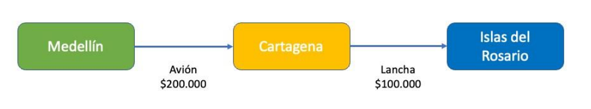

# Taller Prolog 10%

1. Crear una rutina recursiva en Prolog que permita invertir un número dado
    Ejemplo: 123456789 -> 987654321

```prolog
%Un solo digito -> devuelve el mismo numero 
invertir(N, N) :- 
    N < 10.

invertir(N, R) :-
    N >= 10,
    Ultimo is N mod 10,
    N1 is N // 10,
    invertir(N1, R1),
    atom_concat(Ultimo, R1, R). 
    %Es una funcion que encontre para concatenar
    %Visualmente es mas amigable
    %Esta es la otra opcion usando lo aprendido en clase
    %R = R1 + Ultimo
```  

2. Implementar el ejercicio anterior utilizando recursión de cola (Tail Recursion)

```prolog
%Un solo digito -> devuelve el mismo numero 
invertirTr(N, A, R) :- 
    N < 10,
    atom_concat(A, N, R).
    %R = N + A.

invertirTr(N, A, R) :-
    N >= 10,
    Ultimo is N mod 10,
    N1 is N // 10,
    atom_concat(A, Ultimo, A1),
    %A1 = Ultimo + A,
    invertirTr(N1, A1, R).

invertir(N, R):-
    invertirTr(N, "", R).
```  


3. Código recursivo que quita todas las ocurrencias de un elemento en una lista.
Ejemplo 1: quitar(2, [3,5,8,6,2,3,2,3,2], N) el resultado es N = [3,5,8,6,3,3]. \
Ejemplo 2: quitar(g, [d,a,d,g,g,s,d,f], N) el resultado es N = [d,a,d,s,d,f] 

```prolog
% (Caso base) Lista vacia
quitar(_, [], []):- !.

% N es la cabeza
quitar(N, [N | T], R) :-
    quitar(N, T, R), !.

% N no es la cabeza
quitar(N, [H | T], [H | R]) :-
    N \= H,
    quitar(N, T, R), !.
```

4. Encuentra la representación recursiva de cola (Tail recursion) para los siguientes casos: \
   a. fibonacci(X,Y), Y es el X-simo número de Fibonacci.

```prolog
% "inicializar acumuladores"
fibonacci(N, R) :- fibonacci(N, 0, 1, R), !.
% Termina cuando llega al A-esimo fibonacci
fibonacci(0, A, _, A).
fibonacci(N, A_Anterior, A, R) :-
    N > 0,
    N_Siguient is N - 1,
    A_Siguiente is A_Anterior + A,
    fibonacci(N_Siguient, A, A_Siguiente, R).
```

b. producto(X,Y,Z), Z es el producto de X por Y. 

```prolog
% Cuando sea 0, termine (caso base)
producto(0, _, 0):- !.

producto(X,Y,Z):-
    X > 0,
    X1 is X - 1,
    producto(X1, Y, Z1),
    Z is Z1 + Y.
```


5. Resolver mediante verificación de restricciones en PROLOG el Sudoku 4*4 que aparece a continuación.\
| &nbsp; &nbsp;  |  &nbsp; &nbsp;  | 1 | &nbsp;&nbsp;  | \
|  &nbsp; &nbsp;  | 1 |  &nbsp; &nbsp;  | 2 |\
| &nbsp; &nbsp;   | &nbsp; &nbsp;   | &nbsp;  &nbsp;  | 3 |\
|  &nbsp;  &nbsp; |  &nbsp;  &nbsp; | 4 |  &nbsp;  &nbsp; |

Dar al menos dos soluciones

```prolog
% Hechos
num(1). num(2). num(3). num(4).

% Reglas
unicos(P,Q,R,S) :- num(P), num(Q), num(R), num(S),
\+ P=Q, \+ P=R, \+ P=S, \+ Q=R, \+ Q=S, \+ R=S.


% Solucion
sudoku(R11, R12, R13, R14,
	R21, R22, R23, R24,
	R31, R32, R33, R34,
	R41, R42, R43, R44) :-
    % Numeros del 1 al 4
	num(R11), num(R12), num(R13), num(R14),
    num(R21), num(R22), num(R23), num(R24),
    num(R31), num(R32), num(R33), num(R34),
    num(R41), num(R42), num(R43), num(R44),
    % Numeros en filas 
    unicos(R11,R12,R13,R14),
    unicos(R21,R22,R23,R24),
    unicos(R31,R32,R33,R34),
    unicos(R41,R42,R43,R44),
    %Numeros en columnas
    unicos(R11, R21, R31, R41),
    unicos(R12, R22, R32, R42),
    unicos(R13, R23, R33, R43),
    unicos(R14, R24, R34, R44),
    %Numeros en cuadrantes
    unicos(R11, R12, R21, R22),
    unicos(R13, R14, R23, R24),
    unicos(R31, R32, R41, R42),
    unicos(R33, R34, R43, R44),
    write(' | '), write(R11), write(' | '), write(R12), write(' | '), write(R13), write(' | '), write(R14), write(' | '), nl,
    write(' | '), write(R21), write(' | '), write(R22), write(' | '), write(R23), write(' | '), write(R24), write(' | '), nl,
    write(' | '), write(R31), write(' | '), write(R32), write(' | '), write(R33), write(' | '), write(R34), write(' | '), nl,
    write(' | '), write(R41), write(' | '), write(R42), write(' | '), write(R43), write(' | '), write(R44), write(' | '), nl.
```

6. Crear un programa llamado viajeros, que permita definir lugar de origen, lugar de destino, tipo de
transporte y precio del transporte. \
Definir un grafo con al menos 6 nodos, como el que aparece a continuación:



* Crear una estructura de hechos que represente cada conexión del grafo.
* Para cada consulta origen-destino, presentar la lista de ciudades en el recorrido, los transportes a utilizar, la lista de precios por trayecto y el Valor Total del viaje.

Por ejemplo: uno de los trayectos posibles (para el grafo de ejemplo), entre Medellín e Islas del Rosario, puede ser: \
Origen = Medellín, \
Destino = Islas del Rosario, \
Recorrido = [Medellín, Cartagena, Islas del Rosario], \
Precio total = 300000, \
Precios por trayecto = [200000, 100000], \
Tipos de transporte = [Avión, Lancha]  

```prolog
% Hechos
% viaje(origen, destno, precio, transporte) 
viaje(santorini, monaco, 15000, jet_privado).
viaje(nueva_york, st_barts, 25000, yate).
viaje(kioto, berlin, 10000, avion).
viaje(venecia, maldivas, 7000, avion).
viaje(st_barts, santorini, 12000, yate).
viaje(berlin, venecia, 8000, tren_orient_express).
viaje(st_barts, monaco, 12000, jet_privado).
viaje(berlin, venecia, 8000, tren_orient_express).
viaje(mykonos, bali, 21000, jet_privado).
viaje(santorini, bali, 9000, yate).
viaje(venecia, mykonos, 8000, avion).

% llamar a enrutar con lista auxiliar
enrutar(Origen, Destino, Recorrido, Precio_por_trayecto, Precio_total, Tipos_transporte) :-
    enrutar(Origen, Destino, [Origen], Recorrido, Precio_por_trayecto, Precio_total, Tipos_transporte).

% Terimar si ya se llego al destino
enrutar(Origen, Destino, Recorrido, Recorrido, [], 0, []) :-
    Origen == Destino.

enrutar(Origen, Destino, Recorrido, RecorridoFinal, [Precio | RestoPrecios], Precio_total, [Transporte | RestoTransportes]) :-
    viaje(Origen, CiudadIntermedia, Precio, Transporte),
    enrutar(CiudadIntermedia, Destino, [CiudadIntermedia | Recorrido], RecorridoFinal, RestoPrecios, Subtotal, RestoTransportes),
    Precio_total is Precio + Subtotal.

% viajes posibles
% nueva_york -> monaco
% kioto-> maldivas
% st_barts -> monaco
% nueva_york -> santorini
% berlin -> bali
```